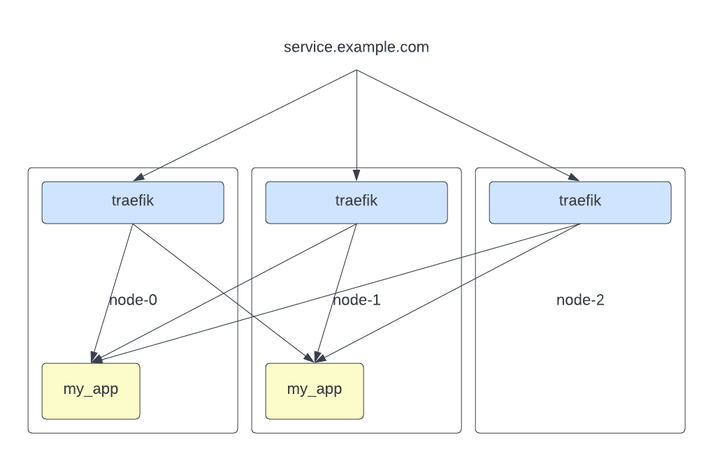

# Automated Docker Swarm bootstrap using Ansible

Build a Docker Swarm cluster using Ansible with swarm. The goal is to rapidly bootstrap a Docker Swarm cluster on machines running: Debian; Ubuntu.

#### 🚨 Disclaimer:

This repo aims to be a **simple** bootstrap of a docker swarm cluster using default configs, **especially** for the services in available [composes](composes/). If you would like more configuration options (considering for security), please read their respective documentations and configure them manually.

---

## ✅ System Requirements

- Control Node (the machine you will be running the Ansible commands). I am using Ansible 2.15.1.
- All swarm nodes (manager and workers) should have passwordless SSH access, this can be setup by passing your SSH public keys in the Oracle Compute Instance configuration. You can also check this [Digital Ocean Guide](https://www.digitalocean.com/community/tutorials/how-to-configure-ssh-key-based-authentication-on-a-linux-server) to set up ssh key based authentication on linux machines.

## 🚀 Getting Started

### 💻 Hardware we will use

For this example, we will be using the [Oracle Cloud Allways-Free Tier](https://www.oracle.com/cloud/free/). We can instantiate one machine per Fault Domain, ensuring our VMs are not all on the same physical hardware.

For this demo, we are using 3 machines (all of them free):

- Ampere aarch64 Altra 4-core CPU w/ 24GB RAM
- AMD x86_64 EPYC 1-core CPU w/ 1GB RAM
- AMD x86_64 EPYC 1-core CPU w/ 1GB RAM

This gives us a total of 8-threads and 26GB of RAM for free!

Since docker swarm is a distributed container orchestration tool, we need `manager` and `worker` nodes. Thus, we can talk about fault tolerance. To keep high availability, we will have all 3 nodes as managers. For this, we can add the public-ip of all of them to your DNS, as traefik (the reverse proxy we will be using must run on managers to retrieve info about the swarm).

> You should maintain an odd number of managers in the swarm to support manager node failures. Having an odd number of managers ensures that during a network partition, there is a higher chance that the quorum remains available to process requests if the network is partitioned into two sets. Keeping the quorum is not guaranteed if you encounter more than two network partitions. https://docs.docker.com/engine/swarm/admin_guide/#add-manager-nodes-for-fault-tolerance

Our architecture will look something like this (if you decide to bootstrap included services):

The DNS will point to our manager nodes (in this case, all of them) and traefik will be exposed on all on port 80 (HTTP) and 443 (HTTPS).

### 🍴Preparation

The first thing we need to do after getting our hardware ready is create a [hosts.ini](hosts/hosts.ini) file. You must have at least one manager node.

```ini
[node0]  # The node you will use to run init the swarm (must be a manager)
1.2.3.4

[all]  # all nodes public ips
1.2.3.4
1.2.3.5
1.2.3.6

[managers]  # manager nodes public ips
1.2.3.4

[workers]  # worker nodes public ips
1.2.3.5
1.2.3.6
```

In this demo, we assume the default user is ubuntu. But that can be changed on the header of every file inside the [playbooks](playbooks/) directory.

```yaml
---
- name: Setup Oracle VMs
  hosts: all
  become: true
  remote_user: ubuntu # <- This is the user
  ...
```

## 🐳 Creating the Cluster

After creating your hosts file and configuring the default remote user, we can start running the playbooks.

To setup the cluster and install dependencies:

> NOTE: this command DISABLES iptables firewall, do NOT host services on bare-metal after this.

```sh
ansible-playbook -i hosts/hosts.ini playbooks/setup.yml
```

Then, to initiailze the cluster:

```sh
ansible-playbook -i hosts/hosts.ini playbooks/bootstrap_swarm.yml
```

The script already takes care of the different swarm join tokens, so there is no need for extra configuration.

If anything goes wrong or you just want to dismantle the swarm, simply run:

```sh
ansible-playbook -i hosts/hosts.ini playbooks/dismantle_swarm.yml
```

## 🚚 Base Services

If you also want to already bootstrap some base services, you can use this section to do so. The services that will be installed here are:

- [Traefik](https://doc.traefik.io/traefik/) - reverse proxy to access the cluster services
- [Portainer](https://www.portainer.io/) - container orchestration web UI
- [Registry](https://hub.docker.com/_/registry) - container (private) registry for your docker images - Note that we are going to be using simple HttpAuth, check [this](https://medium.com/@maanadev/authorization-for-private-docker-registry-d1f6bf74552f) for other options
- [SwarmCronjob](https://crazymax.dev/swarm-cronjob/) - **Simple** cronjob solution
<!-- - [Swarmpit](https://swarmpit.io/) - **Simple** hardware monitoring solution used for the cluster (also does simpler container orchestration and is mobile friendly!) -->

To bootstrap these services, we'll need to do a tiny bit more configuring. To use traefik, well need a domain name, and since in this example we use it to create SSL certificates, we need a maintainer email. To configure it, go to [bootstrap_essential_services.yml](playbooks/bootstrap_essential_services.yml) and check the `vars` section:

```yaml
---
- name: Bootstrap Essentials
  hosts: node0
  remote_user: ubuntu
  vars:
    domain_name: "cloud.example.com" # <- your domain
    maintainer_email: "my.email@email.com" # <- your email
    basic_auth_password: "adminPass" # <- registry and traefik http password
```

After configuring it, simply run:

```sh
ansible-playbook -i hosts/hosts.ini ansible/bootstrap_essential_services.yml
```

Traefik will take a few moments to generate the TLS certificates but after that, you can access those services with their subdomain. For example:

Portainer: `portainer.cloud.example.com`

Remember that in the case of portainer, you have a limited ammount of time to access it and create the admin user, if you don't, you'll need to restart the container service (on a manager node: `docker service update portainer_portainer`).

#### 🗒️ NOTEs:

- traefik http_pass config is: `admin:adminPass`, to change it, take a look at [traefik/create_pass.sh](traefik/create_pass.sh) and [traefik/docker-compose.yml](traefik/docker-compose.yml).
- the portainer version we are running is the Community Edition (CE), you can run the Enterprise Edition (EE) for [free for up to 3-nodes](https://www.portainer.io/take-3) it gives some pretty cool functionality to update services automatically with github actions (simple POST request) for example, access to the private registry and more.

### 👟 Running your own services

Since we have a small cluster with very limited resources, it is pretty important to set resource limits in the compose files. To create the routes in traefik, you must add these labels to the `deploy` segment in the compose file:

```yaml
deploy:
  labels:
    - traefik.enable=true
    - traefik.http.services.${MY_SERVICE_NAME}.loadbalancer.server.port=${TARGET_PORT}
    - traefik.http.routers.${MY_SERVICE_NAME}.rule=Host(`${SUBDOMAIN_TO_REDIRECT}.${DOMAIN_NAME}`)
    - traefik.http.routers.${MY_SERVICE_NAME}.entrypoints=websecure
    - traefik.http.routers.${MY_SERVICE_NAME}.tls=true
    - traefik.http.routers.${MY_SERVICE_NAME}.tls.certresolver=leresolver
    # - traefik.http.routers.${MY_SERVICE_NAME}.middlewares=admin-auth  # this line enables the admin-auth on the service
    # - traefik.http.routers.${MY_SERVICE_NAME}.service=${MY_SERVICE_NAME} # only needed if going to use more than 1 route per service
```

In this yaml snippet, we have 4 vars:

- MY_SERVICE_NAME: The name of the service in the compose file (i.e. "app")
- SUBDOMAIN_TO_REDIRECT: The subdomain used to redirect to that service
- DOMAIN_NAME: Your domain name (can be used in conjunction with the subdomain to redirect from a whole new domain)
- TARGET_PORT: The port where the service is running in it's container

### 🍪 Thanks

This repo was somewhat inspired by [tecno-tim's k3s-ansible](https://github.com/techno-tim/k3s-ansible). Check him out!

- [k3s-io/k3s-ansible](https://github.com/k3s-io/k3s-ansible)
- Hat tip to everyone who's code was used!
